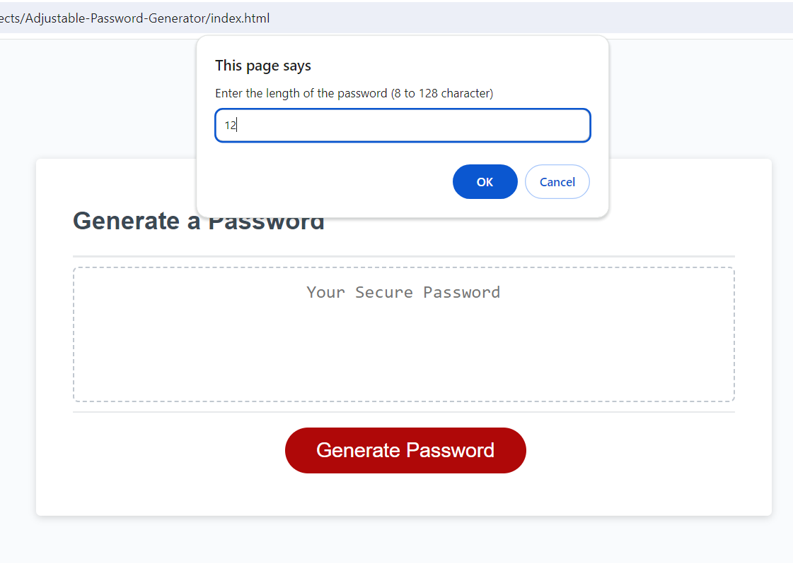
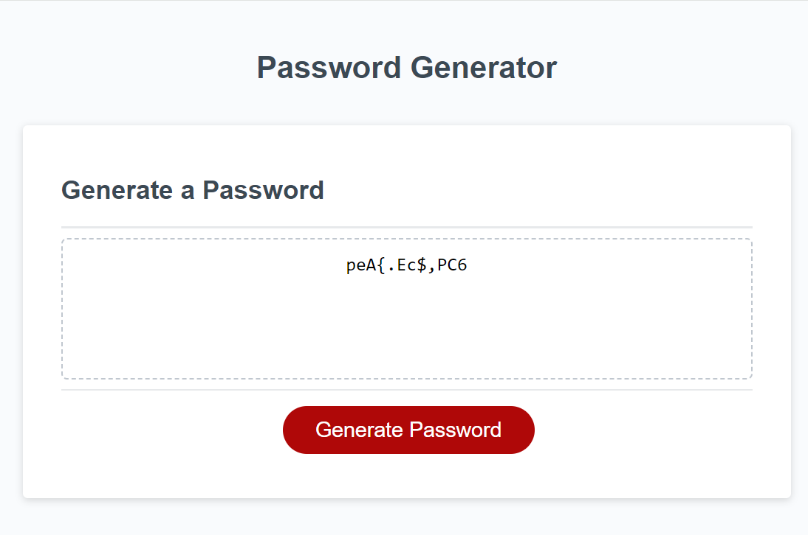

# Adjustable-Password-Generator

## Description

In this project, we've developed an [Adjustable Password Generator](https://foroughgoudarzi.github.io/Adjustable-Password-Generator/) application, enabling users to generate a customized, random password based on their specified criteria. This browser-based app functions by allowing users to select the desired password length and the specific character types they want to include. Upon clicking the "Generate Password" button, the application generates a password, displaying it on the screen.

Below, you'll find screenshots depicting the application in action.

<figure>

<figcaption><em>Figure.1. Prompting for password options</em></figcaption>
</figure>

 

<figure>

<figcaption><em>Figure.2. Displaying the generated password</em></figcaption>
</figure>

## Instalation

N/A

## Credits

The following resources were used:

* https://www.w3schools.com
* https://developer.mozilla.org

## License

Please refer to the [LICENSE](./LICENSE) file.